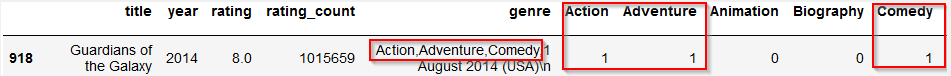

# K-Nearest-Neighbor-IMDB-Project

+ [Table of Contents](#sub-sub-heading-1)
    + [Credits](#credits)
    + [Project Goal and procedure](#project-goal-and-procedure)
    + [Code and Resources](#code-and-resources)
    + [Part 1- Scraping Data using Selenium and Scrapy](#part-1--scraping-data-using-selenium-and-scrapy)
    + [Part 2- Data Cleaning and Feature Engineering](#part-2--data-cleaning-and-feature-engineering)
    + [Part 3- Exploratory Data Analysis](#part-3--exploratory-data-analysis)
    + [Part 4- Model Building](#part-4--model-building)

 ### Credits: 
 A big thank you goes to [KenJee](https://www.youtube.com/channel/UCiT9RITQ9PW6BhXK0y2jaeg), [Codebasics](https://www.youtube.com/channel/UCh9nVJoWXmFb7sLApWGcLPQ), [Krish Naik](https://www.youtube.com/user/krishnaik06), [Keith Galli](https://www.youtube.com/channel/UCq6XkhO5SZ66N04IcPbqNcw)  and to the whole [Edureka Team](https://www.youtube.com/user/edurekaIN) who put a lot of effort to teach people Data Science, Machine Learning, Statistics and a lot of other related topics for free.
 
 
### Project Goal and Procedure
* Goal: Create a model which can classify similar movies from [IMDB.com](https://www.imdb.com/), based on the rating and genre information by using the KNN Machine Learning Algorithm
* Dataset was scraped using Python, Selenium and Scrapy
* Saved results in a csv file and manipulated and worked with the data using the pandas package
* Visualization of data using seaborn and matplotlib packages
* Built a K Nearest Neighbor Model
 
### Code and Resources
* Python Version: 3.7
* Environment: Visual Studio, Jupyter Notebook
* Packages: Scrapy, Selenium, Scipy, Matplotlib, Seaborn, Numpy
 
 
 
# Part 1- Scraping Data using Selenium and Scrapy
The relevant data was extracted in two steps. In the first step I wrote a script by using selenium so that specific steps were completed automatically when the script ran.
In detail, the selenium script exists of the following instructions:
 
  * Go to Google.com
 * Search for 'IMDB' and click on the first result
 * Find the dropdown menu and click on the 'Advanced Search' button
 * Select 'Feature Film'
 * Select'TV Movie'
 * Find movies from 1990-2020
 * Find movies which have a rating from 1 to 10
 * Find movies which are Oscar nominated
 * Select just color movies
 * Select just english speaking movies
 
If you want to see how the Selenium scraper behaves by executing the mentioned instructions, just click on the icon below (you will be redirected to Google Drive- make sure you watch the video with the highest resolution :
 

 

 
 Finally, the URL is handed over to the **Scrapy** script which took care for clickling on each result and extracted the following information:
 * movie title
 * movie year
 * movie rating
 * movie rating count
 * movie genre
 
 

 
 
 
 
 
 
 ### Output in pandas after scraping (first 5 entries):
 
  
 
 
 # Part 2- Data Cleaning and Feature Engineering
 
 After scraping the data and storing it in csv and pandas, I had to do some cleaning and modifying steps like:
 * remove unnecessary string elements
 * convert particular columns to integers and floats to make it machine readable 
 * In order to be able to create distance metrices between the movies, we need to normalize the rating counts. As a result we get back a value between '0' and '1'. '1' means that the movie has the highest rating count whereas a '0' expresses that a given movie received the smallest amount of rating compared to all the other movies.  
 * create columns for each genre by extracting information from the genre column('1' = movie falls into a specific genre, '0' = movie does not fall into a specific genre). 
 

#### The following snippet hightlights that the movie 'Guardians of the Galaxy' falls into the genres 'Action', 'Adventure', 'Comedy':

  
  
  
 
 

 

